# УДК 004.852:004.032.26      DOI:

# SpikeRuGPT: адаптация импульсной языковой модели SpikeGPT к русскому языку и анализ нейроморфной спарсити

Хакимов А. Т.^1^, Сомов О. Д.^1,2^

^1^ Национальный исследовательский университет «Московский физико-технический институт»  
^2^ Artificial Intelligence Research Institute (AIRI), Москва

141701, Московская область, г. Долгопрудный, Институтский переулок, д. 9.  
khakimov.at@phystech.edu

## Аннотация

В работе представлена адаптация импульсной языковой модели SpikeGPT к русскому языку. Модель основана на RWKV-подобной архитектуре с бинарными событийно-управляемыми LIF-нейронами: Spiking RWKV выполняет смешение информации по токенам, а Spiking Receptance Feed-Forward Network выполняет поканальное преобразование признаков. Такая структура согласуется с последовательной природой языкового моделирования и позволяет заменить квадратичную self-attention-рекуррентным механизмом, совместимым со спайковой динамикой. Первая версия SpikeRuGPT размером около 100 млн параметров была обучена на корпусе «Тайга» объемом около 1,8 млрд токенов и достигла валидационной перплексии 59,79. Дополнительно построен воспроизводимый пайплайн обучения более компактной версии на 73,7 млн параметров с SentencePiece BPE-словарем на 32 тыс. токенов; модель прошла около 0,95 млрд токенов русскоязычного предобучающего корпуса. Выполнено сравнение нейроморфной спарсити русскоязычной модели с англоязычной SpikeGPT-OpenWebText-216M: средний firing rate для русского составил 33,2% против 21,7% для английского, то есть русский текст требует примерно на 53% больше спайков в данной постановке. Также исследованы обучаемые параметры LIF-нейронов, показана иерархия временных масштабов по слоям, проведены эксперименты с инструкционным дообучением и анализом очистки SFT-данных. Полученные результаты показывают, что SpikeGPT-подобная архитектура применима к русскому языку, однако качество малых моделей существенно зависит от корпуса, tokenizer-а и чистоты инструкционных данных.

Ключевые слова: импульсные нейронные сети; нейроморфные вычисления; SpikeGPT; RWKV; LIF-нейроны; русский язык; firing rate; языковые модели.

## Abstract

This paper presents an adaptation of the spiking language model SpikeGPT to Russian. The model is based on an RWKV-like architecture with binary event-driven LIF neurons: Spiking RWKV performs token mixing, while the Spiking Receptance Feed-Forward Network performs channel mixing. This structure matches the sequential nature of language modeling and replaces quadratic self-attention with a recurrent mechanism compatible with spiking dynamics. The first SpikeRuGPT version with approximately 100 million parameters was trained on the Taiga corpus containing about 1.8 billion tokens and reached a validation perplexity of 59.79. We additionally built a reproducible training pipeline for a compact 73.7M-parameter version with a 32k SentencePiece BPE vocabulary; this model was trained on approximately 0.95B Russian tokens. We compare neuromorphic sparsity of the Russian model with SpikeGPT-OpenWebText-216M: the average firing rate is 33.2% for Russian versus 21.7% for English, meaning that Russian text requires about 53% more spikes in this setup. We also investigate trainable LIF parameters, observe a layer-wise hierarchy of time scales, and analyze instruction tuning with strict SFT data cleaning. The results show that SpikeGPT-like architectures are applicable to Russian, while the quality of small models is highly sensitive to corpus composition, tokenizer design, and instruction-data quality.

Keywords: spiking neural networks; neuromorphic computing; SpikeGPT; RWKV; LIF neurons; Russian language; firing rate; language models.

## 1. Введение

Современные языковые модели демонстрируют высокое качество генерации текста, однако их вычислительная стоимость остается существенным ограничением. Одним из направлений снижения энергопотребления являются импульсные нейронные сети (spiking neural networks, SNN), в которых вычисление представляется не как непрерывная активация всех нейронов, а как поток дискретных событий - спайков. Для нейроморфных ускорителей, таких как Intel Loihi и BrainScaleS, число спайков напрямую связано с числом аппаратных событий, а следовательно, с энергопотреблением [1].

Модель SpikeGPT [2] стала одним из первых примеров применения импульсных нейронных сетей к генеративному языковому моделированию. Она сочетает RWKV-подобную рекуррентную архитектуру [3] с LIF-нейронами и тем самым позволяет изучать не только качество языковой модели, но и внутреннюю спайковую активность. При этом исходные эксперименты SpikeGPT были ориентированы на англоязычные корпуса.

Русский язык представляет особый интерес для такого анализа. Он является морфологически богатым: падежи, согласование по роду и числу, словоизменение и относительно свободный порядок слов создают дополнительные зависимости между токенами. Поэтому для русского языка важно не только проверить, сходится ли SpikeGPT-подобная модель при обучении, но и понять, как меняется ее нейроморфная активность по сравнению с англоязычной моделью.

В данной работе решаются четыре задачи. Во-первых, обучается русскоязычная импульсная языковая модель SpikeRuGPT на архитектуре SpikeGPT. Во-вторых, описывается, как последовательная языковая модель может быть согласована со спайковой динамикой через Spiking RWKV и LIF-нейроны. В-третьих, измеряется firing rate модели и исследуется связь между морфологической сложностью языка и нейроморфной спарсити. В-четвертых, проводится воспроизводимая серия экспериментов с компактной русскоязычной моделью, очисткой предобучающего и инструкционного корпуса, а также сравнением с предыдущей версией модели и открытой англоязычной SpikeGPT.

## 2. Архитектура SpikeRuGPT

SpikeRuGPT построена на архитектуре SpikeGPT, где каждый блок включает временное смешение RWKV-типа, поканальное смешение и LIF-нелинейности. RWKV-компонента обеспечивает эффективную обработку последовательности без квадратичной attention-матрицы, а LIF-нейроны вводят событийную динамику.

В классической LIF-модели мембранный потенциал нейрона накапливает входной сигнал и порождает спайк при достижении порога. После спайка состояние нейрона обновляется, что делает модель дискретной и событийно-управляемой. В языковой модели такая динамика позволяет анализировать, какая доля нейронов активируется при обработке реального текста.

В исходной работе SpikeGPT ключевая идея состоит в том, чтобы не добавлять искусственное временное измерение поверх текста, как это часто делается в SNN-подходах, а использовать саму последовательность токенов как временную ось. Токены подаются в модель последовательно, а рекуррентная структура RWKV сохраняет информацию о предыдущих шагах. Это делает архитектуру естественно однонаправленной и подходящей для autoregressive language modeling.

Блок SpikeGPT состоит из двух основных частей. Spiking RWKV работает как token mixer: он смешивает информацию между позициями последовательности через рекуррентные состояния и learnable decay-параметры. Spiking Receptance Feed-Forward Network работает как channel mixer: он преобразует признаки внутри позиции и управляет прохождением информации через gated-механизм. После этих операций используются LIF-нейроны, переводящие непрерывные сигналы в бинарную спайковую активность. В оригинальной статье эта структура показана как спайковый аналог transformer-блока с residual-связями [2].

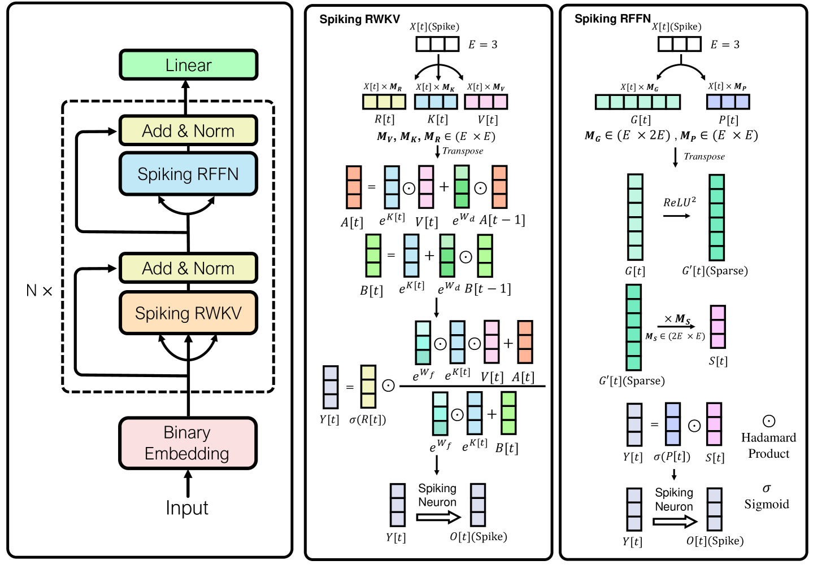

Рис. 1. Архитектура SpikeGPT: Spiking RWKV выполняет смешение по токенам, Spiking RFFN - смешение по каналам; LIF-нейроны формируют бинарную событийную активность. Рисунок адаптирован из [2].

При обучении используется стандартная autoregressive objective: модель предсказывает следующий токен по предыдущим. Отличие от обычной dense LM состоит в том, что промежуточные представления проходят через LIF-динамику, а недифференцируемый Heaviside-порог обучается через surrogate gradient. В SpikeGPT используется arctangent surrogate function, позволяющая применять backpropagation к спайковым блокам [2].

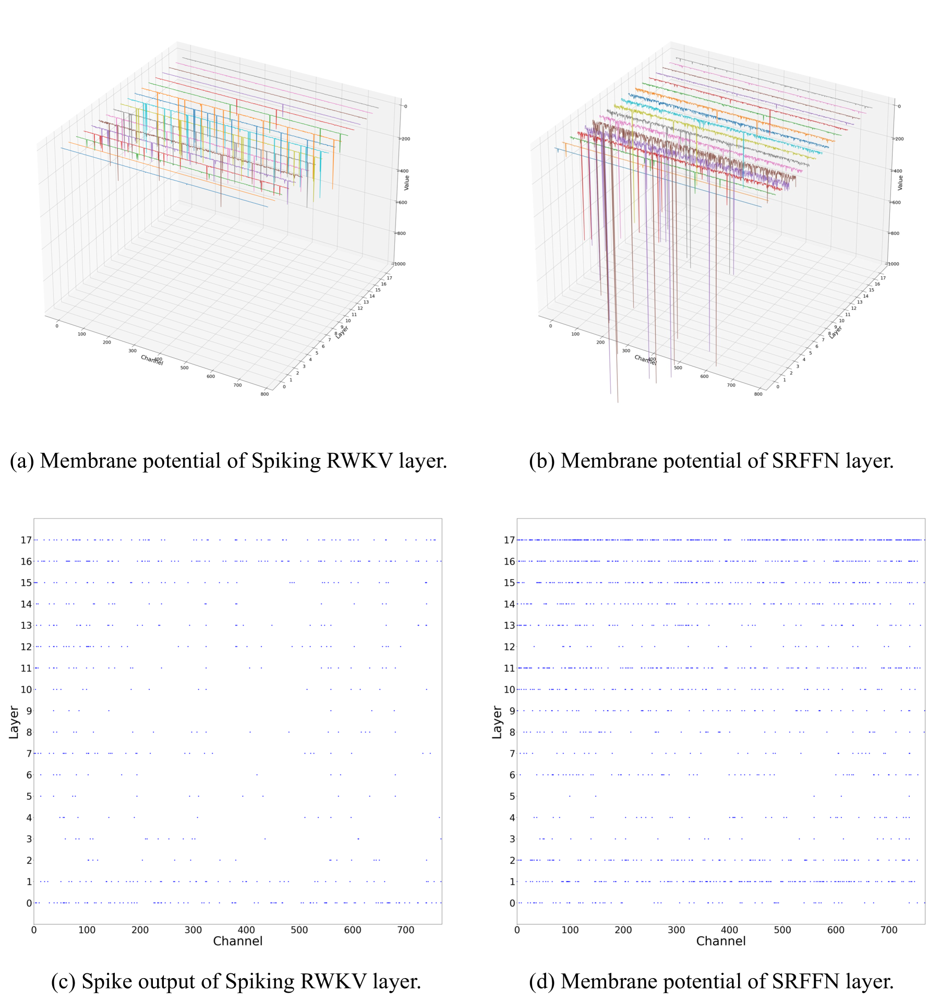

Рис. 2. Визуализация мембранного потенциала и спайковых событий в SpikeGPT. Точки соответствуют отдельным spike-событиям. Рисунок адаптирован из [2].

Конфигурация обученной русскоязычной модели приведена в таблице 1.

| Параметр | Значение |
|---|---|
| Архитектура | SpikeGPT (RWKV + MultiStepLIF) |
| Число параметров | около 100M |
| Число слоев | 12 |
| Размер скрытого состояния | 512 |
| Длина контекста | 1024 токена |
| Tokenizer | ruGPT-3 Large BPE, vocab = 50 258 |
| Обучающий корпус | «Тайга»: taiga_stripped_rest + taiga_stripped_proza |
| Объем данных | около 1,8 млрд токенов |
| Оборудование | NVIDIA A100 SXM 80 GB |

Таблица 1. Конфигурация SpikeRuGPT.

## 3. Обучение русскоязычной модели

Модель обучалась с нуля на русскоязычном корпусе «Тайга». Корпус содержит художественные, публицистические и новостные тексты, что делает его подходящим для базового языкового моделирования, но не покрывает специализированные технические домены в достаточной степени.

В процессе обучения наблюдалась устойчивая сходимость. Лучший результат был достигнут на эпохе 260: validation perplexity составила 59,79. Финальная train perplexity составила около 64. Небольшой разрыв между train и validation указывает на умеренное переобучение, ожидаемое для модели такого размера и корпуса с выраженной жанровой структурой.

| Метрика | Значение |
|---|---:|
| Лучшая validation perplexity | 59,79 |
| Эпоха лучшего checkpoint-а | 260 |
| Train perplexity в конце обучения | около 64 |
| Скорость обучения | около 2 мин/эпоха на A100 |

Таблица 2. Результаты обучения SpikeRuGPT.

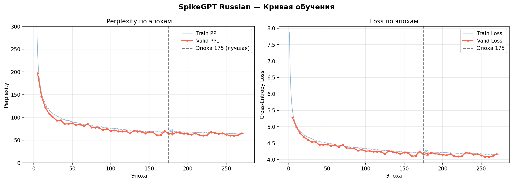

Рис. 3. Динамика обучения SpikeRuGPT на корпусе «Тайга».

Полученный результат подтверждает применимость архитектуры SpikeGPT к русскому языку. Модель является базовой языковой моделью без instruction tuning, поэтому ее генерации следует оценивать как продолжение текста в стиле обучающего корпуса, а не как ответы ассистента.

## 4. Нейроморфная спарсити русской и английской моделей

Для нейроморфных языковых моделей важна не только перплексия, но и firing rate - средняя доля активных LIF-нейронов при обработке текста. Чем ниже firing rate при сохранении качества, тем меньше событий должна обработать нейроморфная система.

Для русскоязычной SpikeRuGPT firing rate измерялся на фрагментах корпуса «Тайга». Для сравнения использовалась открытая англоязычная модель SpikeGPT-OpenWebText-216M, оцененная на фрагментах OpenWebText. Модели различаются размером, поэтому сравнение не является абсолютно изолированным языковым экспериментом, однако оно показывает важную практическую тенденцию.

| Модель | Корпус оценки | Firing rate | Доля молчащих нейронов |
|---|---|---:|---:|
| SpikeGPT Russian, 12L-512D | Тайга | 33,2% | 66,8% |
| SpikeGPT English, 18L-768D | OpenWebText | 21,7% | 78,3% |

Таблица 3. Сравнение средней спайковой активности.

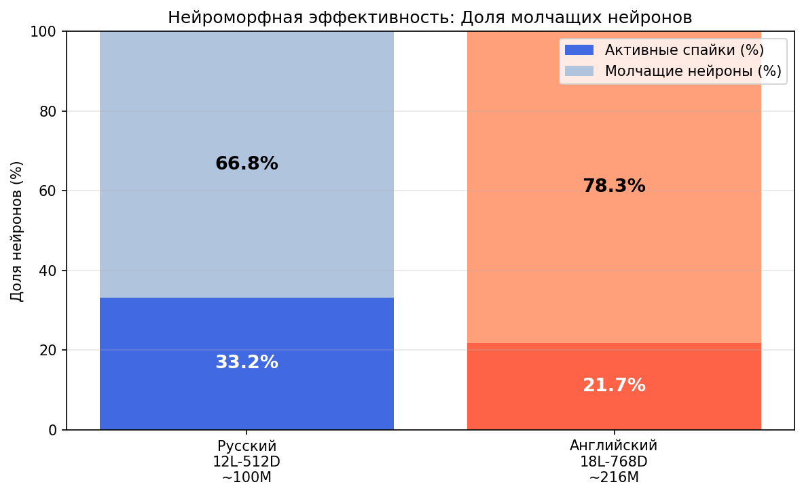

Рис. 4. Средний firing rate русскоязычной и англоязычной моделей.

Русскоязычная модель требует примерно в 1,53 раза больше спайков: 0,332 / 0,217 = 1,53. Если рассматривать firing rate как приближенную оценку числа аппаратных событий, то обработка русского текста может требовать примерно на 53% больше нейроморфных операций по сравнению с английским в данной постановке.

Послойный анализ показывает U-образный профиль активности: высокая активность в начальных слоях, спад в средних и рост ближе к выходу. Такая структура наблюдается у обеих моделей, но русскоязычная модель значительно активнее в средних слоях.

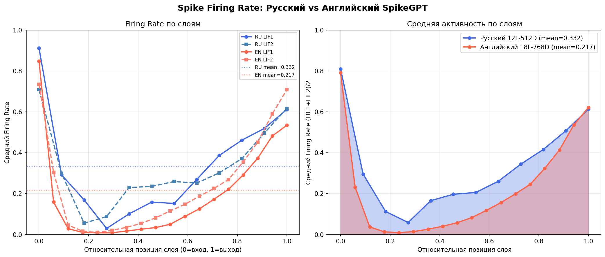

Рис. 5. Послойная спайковая активность русскоязычной модели.

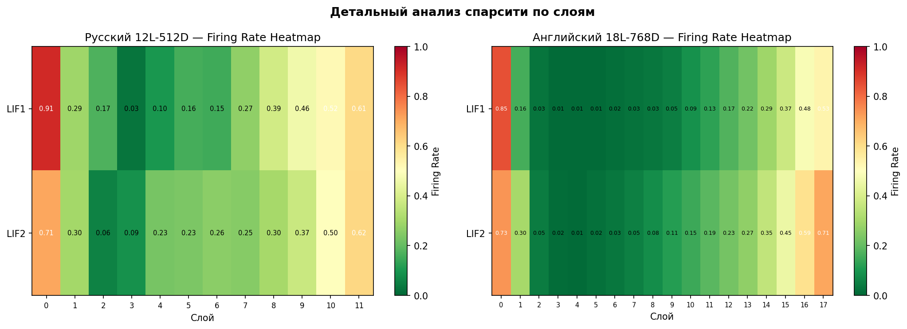

Рис. 6. Сравнение активности по относительной глубине слоя для русской и английской моделей.

Наиболее выраженное различие наблюдается в средней части сети. У англоязычной модели активность LIF2 в ряде средних слоев падает до 1-5%, тогда как русскоязычная модель поддерживает активность порядка 20-25%. Возможная интерпретация состоит в том, что модель вынуждена раньше и активнее кодировать морфологические зависимости: падежи, согласование, грамматическую роль слова и связь удаленных токенов.

Этот результат не доказывает сам по себе универсальный закон для всех языков и архитектур, но показывает, что язык целевого применения может быть важным фактором при оценке энергобюджета нейроморфной языковой модели.

## 5. Обучаемые параметры LIF-нейронов

В базовой реализации SpikeGPT LIF-нейроны используют фиксированную мембранную постоянную времени τ. Такое решение просто, но предполагает, что всем слоям подходит одинаковая динамика. Для языковой модели это ограничение неочевидно: нижние слои обрабатывают локальные лексические признаки, а верхние должны интегрировать более длинный синтаксический и семантический контекст.

Для проверки этой гипотезы была реализована модификация LearnableLIF, где τ и порог возбуждения θ являются обучаемыми параметрами. Для сохранения физически корректной области значений параметры задавались через softplus, что обеспечивает τ > 1 и θ > 0. В качестве суррогатного градиента использовалась ATan-функция.

Были проведены два эксперимента. В первом случае использовался checkpoint SpikeRuGPT, при этом все веса модели были заморожены, а обучались только параметры LIF-нейронов. Во втором случае малая модель той же архитектурной семьи обучалась с нуля совместно со всеми параметрами.

| Слой | τ начальное | τ финальное lif1 | τ финальное lif2 |
|---:|---:|---:|---:|
| 0 | 1,41 | 1,61 | 1,60 |
| 3 | 1,57 | 1,82 | 1,82 |
| 6 | 1,72 | 2,00 | 2,00 |
| 9 | 1,84 | 2,16 | 2,16 |
| 11 | 1,92 | 2,24 | 2,25 |

Таблица 4. Адаптация τ при замороженных весах основной модели.

Для основной модели корреляция Пирсона между номером слоя и τ составила +0,996. Это указывает на почти линейный рост временного масштаба с глубиной. В малой модели, обученной с нуля, также наблюдалась монотонная зависимость, с корреляцией +0,769.

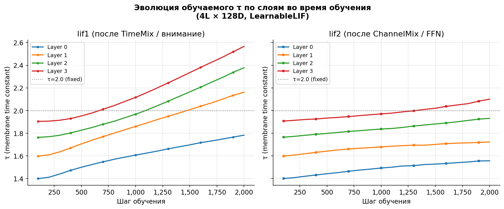

Рис. 7. Эволюция обучаемых параметров τ.

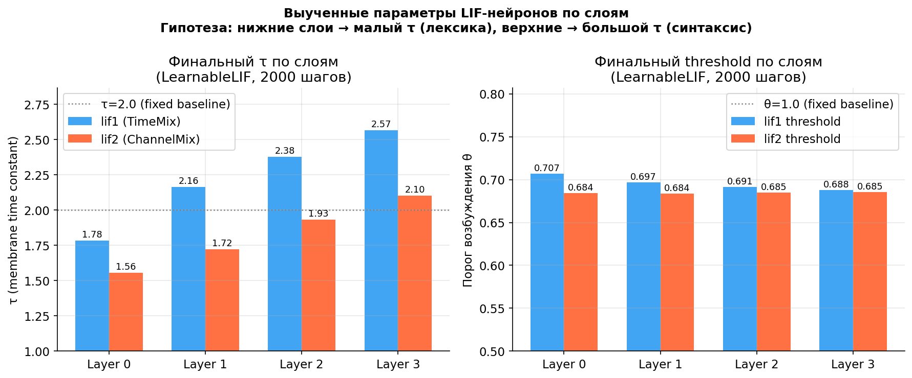

Рис. 8. Финальные значения τ по слоям.

Полученный результат согласуется с иерархической интерпретацией языковой модели: нижние слои требуют более быстрой реакции на локальные признаки, а верхние - более медленной интеграции контекста. Фиксированное τ = 2,0 в таком случае является компромиссом, который может быть неоптимален для части слоев.

## 6. Качественная оценка генерации

Поскольку SpikeRuGPT обучалась как базовая языковая модель, ее генерации являются продолжением заданного prompt-а. На художественных и публицистических фрагментах модель генерирует связный русский текст и сохраняет стиль корпуса. На factual и технических запросах чаще появляются ошибки, что ожидаемо из-за ограниченного размера модели и состава обучающих данных.

Пример художественного prompt-а:

```text
— Ты понимаешь, что это невозможно? — спросил он.
— Почему же,
```

Фрагмент генерации:

```text
— Почему же, так и не надо? Это просто анекдот. Почему ты не ешь?
— Потому что я должен думать. У меня есть другая идея. Чтобы только из этого получилось.
Ты знаешь, как мне тебя называть?
```

Пример публицистического prompt-а:

```text
В октябре 1917 года в Петрограде произошли события, которые навсегда изменили
```

Фрагмент генерации:

```text
значение для жизни страны. В результате большевистского восстания 1917 года погибло больше 800 человек...
```

Эти примеры показывают, что модель усваивает русскоязычную форму и жанровые паттерны, но не является достоверным источником фактов. Для применения в технических областях, включая микроэлектронику, требуется доменное дообучение.

## 7. Расширенная серия экспериментов и воспроизводимый пайплайн

После первой версии модели была проведена дополнительная серия экспериментов, направленная на воспроизводимость, контроль качества данных и параметрическую эффективность. В этой серии использовалась модель той же архитектурной семьи, но с меньшим словарем SentencePiece BPE на 32 тыс. токенов и более строгой фильтрацией корпуса. Такая версия содержит 73,7 млн параметров при 12 слоях, размере скрытого состояния 512 и длине контекста 1024 токена.

| Модель | Параметры | Tokenizer | Данные | Роль в работе |
|---|---:|---|---|---|
| SpikeRuGPT v0 | 92,4M | ruGPT-3 BPE, 50k | «Тайга», около 1,8B токенов | первая русскоязычная baseline-модель |
| SpikeRuGPT v1 base | 73,7M | SentencePiece BPE, 32k | смешанный очищенный корпус, около 0,95B токенов | воспроизводимый pretrain-пайплайн |
| SpikeRuGPT v1 SFT | 73,7M | SentencePiece BPE, 32k | 45 тыс. инструкционных примеров | диагностическое instruction tuning |
| SpikeGPT English | 215,4M | GPT-NeoX tokenizer | OpenWebText, около 5B токенов | англоязычная референсная модель |

Таблица 5. Сравниваемые модели и их роль в экспериментальной части.

Главная причина уменьшения словаря состоит в том, что для малых моделей embedding и language modeling head занимают значительную долю параметров. В исходной модели с vocab = 50 258 эти компоненты занимают около 51,46M параметров, тогда как при vocab = 32 000 - около 32,77M. При этом плотность кодирования русского текста на validation-фрагменте остается близкой.

| Tokenizer | Tokens | Chars/token | Bytes/token |
|---|---:|---:|---:|
| ruGPT-3 BPE, 50k | 1 895 156 | 4,331 | 7,810 |
| SentencePiece BPE, 32k | 1 878 879 | 4,369 | 7,877 |

Таблица 6. Сравнение плотности tokenizer-ов на общем русском validation-фрагменте.

Новая версия была обучена примерно на 944,6 млн показанных токенов. Оценка проводилась на нескольких независимых разбиениях: смешанная валидация, Wikipedia-подобные тексты, литературные тексты, Habr-подобные технические тексты и небольшая train-sample выборка. Метрики показывают ожидаемую жанровую неоднородность: лучше всего модель предсказывает энциклопедический русский текст, хуже - технические и литературные фрагменты с более длинными зависимостями и выраженным стилем.

| Split | Loss | Perplexity |
|---|---:|---:|
| train_sample | 4,7286 | 113,13 |
| val_mixed | 4,7730 | 118,27 |
| val_wiki | 4,2470 | 69,90 |
| val_lit | 4,9063 | 135,14 |
| val_habr | 4,9269 | 137,96 |

Таблица 7. Финальная оценка SpikeRuGPT v1 base после предобучения на 0,95B токенов.

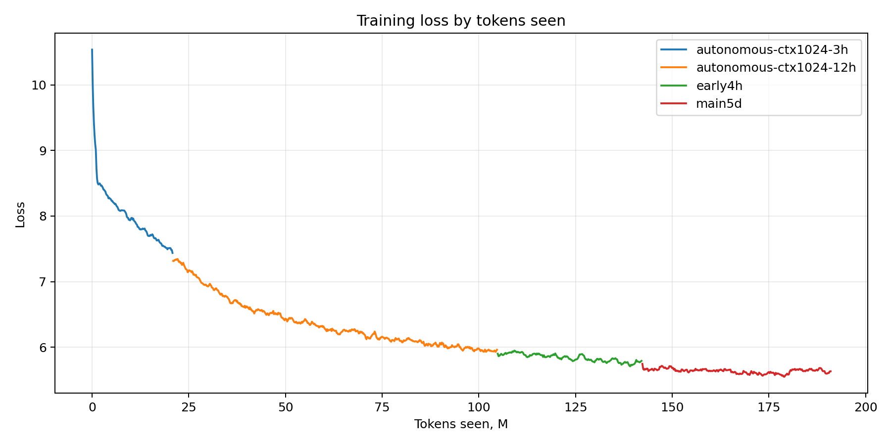

Рис. 9. Динамика обучения воспроизводимой версии SpikeRuGPT v1 base.

Промежуточные checkpoint-ы новой модели показывали положительную динамику: validation loss снижался, а средний firing rate уменьшался. Это можно интерпретировать как формирование более разреженного внутреннего представления по мере обучения.

| Split | v1 3h loss | v1 12h loss | v1 3h firing | v1 12h firing |
|---|---:|---:|---:|---:|
| val_wiki | 7,4983 | 5,6233 | 0,1256 | 0,0953 |
| val_lit | 6,9081 | 5,5918 | 0,1338 | 0,0971 |
| val_habr | 7,4192 | 5,8409 | 0,1280 | 0,0960 |

Таблица 8. Промежуточная динамика компактной версии модели.

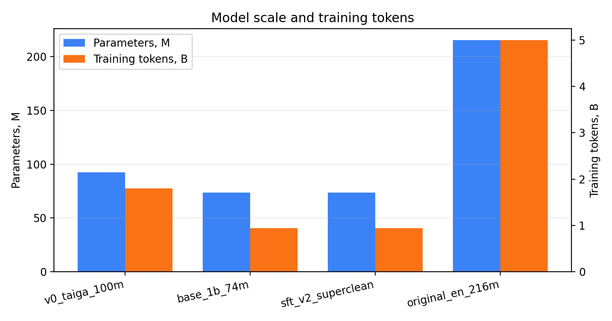

Рис. 10. Сравнение числа параметров русскоязычных моделей и англоязычной референсной SpikeGPT.

Эти результаты не заменяют первую модель SpikeRuGPT v0, которая была обучена на большем русскоязычном корпусе и лучше ведет себя в режиме продолжения текста. Однако новая серия экспериментов важна методически: она фиксирует полный воспроизводимый pipeline подготовки данных, обучения, оценки, анализа спайковой активности и последующего SFT.

## 8. Очистка данных и instruction tuning

Для проверки возможности получить ассистентский режим была собрана русскоязычная SFT-выборка из нескольких открытых источников. Поскольку модель мала по современным меркам, основной акцент был сделан не на количестве сложных инструкций, а на коротких, чистых и одноходовых примерах. Это согласуется с наблюдениями работ по instruction tuning, где качество и соответствие данных целевой задаче часто оказываются важнее простого увеличения объема [6, 7].

Первая SFT-версия содержала 65 056 примеров и дала низкую supervised perplexity, но качественный анализ выявил загрязнение: часть ответов содержала служебные фрагменты вида role/content, markdown-код, Python-подобные токены и следы сериализованных диалоговых структур. Поэтому была собрана вторая, более строгая версия SFT-датасета.

| SFT-набор | Примеров | Характер фильтрации | Supervised PPL | Качественный эффект |
|---|---:|---|---:|---|
| SFT v1 | 65 056 | базовая очистка | 45,93 | появляются технические артефакты |
| SFT v2 superclean | 45 000 | удаление role/content, code-noise и длинных ответов | 60,32 | артефакты устранены, но семантика остается слабой |

Таблица 9. Сравнение двух SFT-наборов.

Финальная superclean-выборка состоит из пяти источников: russian_instructions - 23 670 примеров, russian_easy_instructions - 9 574, ru_turbo_alpaca - 6 383, saiga_scored - 3 071 и ru_turbo_saiga - 2 302. Медианная длина инструкции составила 57 символов, 95-й перцентиль - 129 символов; медианная длина ответа составила 310 символов, 95-й перцентиль - 719 символов. Такой выбор намеренно ограничивает сложность SFT-задачи, чтобы не заставлять малую модель имитировать длинные reasoning-ответы, которые она не успевает надежно освоить.

После обучения на SFT v2 технические артефакты в проверочных генерациях практически исчезли, однако содержательное качество ответов осталось ограниченным. Это важный отрицательный результат: instruction tuning не компенсирует недостаточную силу базовой модели. Для малой SpikeGPT-модели SFT следует рассматривать как настройку формата ответа, а не как способ резко улучшить знание фактов.

Дополнительно была измерена спайковая активность до и после SFT v2. Значимых изменений глобального firing rate не наблюдается: SFT слегка ухудшает LM-loss на continuation-валидации, но почти не меняет среднюю событийную активность.

| Split | Base firing | SFT v2 firing | Base silent | SFT v2 silent |
|---|---:|---:|---:|---:|
| val_wiki | 0,0964 | 0,0977 | 0,4701 | 0,4674 |
| val_lit | 0,0960 | 0,0976 | 0,4897 | 0,4896 |
| val_habr | 0,0926 | 0,0944 | 0,4792 | 0,4788 |

Таблица 10. Спайковая активность SpikeRuGPT v1 base и SFT v2.

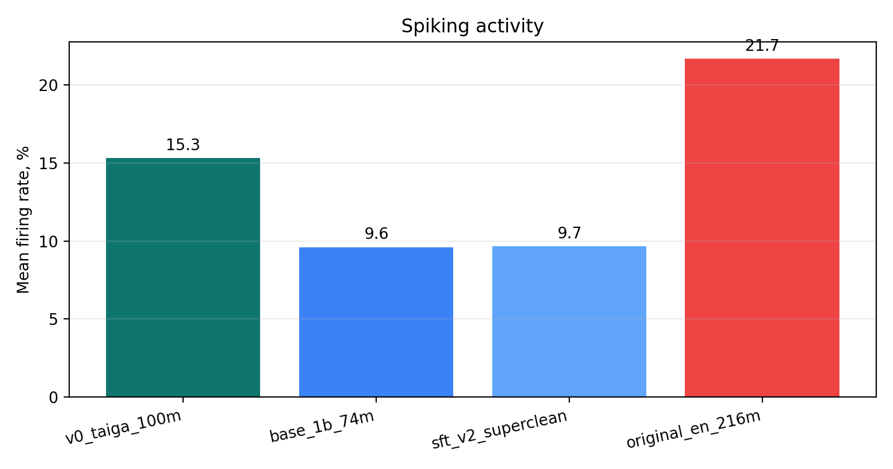

Рис. 11. Сводное сравнение firing rate для русскоязычных и англоязычных моделей.

## 9. Сравнение генерации и связь с исходной SpikeGPT

Для качественной оценки важно разделять два режима: продолжение текста и ответы на инструкции. Первая версия SpikeRuGPT v0 обучалась как базовая языковая модель на корпусе «Тайга», поэтому ее корректнее оценивать именно как continuation-модель. В этом режиме она часто дает более естественные русские фрагменты, чем компактная v1 base, несмотря на меньшую воспроизводимость исходного эксперимента.

Пример prompt-а:

```text
— Ты понимаешь, что это невозможно? — спросил он.
— Почему же,
```

Типичный результат v0 выглядит как продолжение художественного диалога. У v1 base чаще возникает дрейф в сторону шумного web-текста, новостных вставок или сервисных формулировок. После SFT v2 этот дрейф не исчезает полностью: модель лучше избегает служебных артефактов, но не становится устойчивым ассистентом. Поэтому в текущей стадии v0 остается более сильной демонстрацией русскоязычного continuation, а v1 - более прозрачной исследовательской платформой.

Отдельно была загружена и проверена открытая англоязычная SpikeGPT-OpenWebText-216M. При простых английских continuation-prompt-ах она генерирует более связные короткие продолжения, чем компактная русскоязычная v1. Это ожидаемо: английская модель крупнее, обучалась на большем объеме данных и является итоговой моделью из исходной линии SpikeGPT.

Пример англоязычного continuation:

```text
Researchers at the university discovered a new method of measuring glucose levels that could help prevent cancer.
```

Сравнение с оригинальной SpikeGPT важно не как прямой benchmark русского и английского языков, а как инженерная верхняя точка для данной архитектурной семьи. Оно показывает, что SpikeGPT-подобные модели способны генерировать связный текст при достаточном масштабе и объеме pretrain-а. Следовательно, ограничения текущей русскоязычной v1 связаны не только с архитектурой, но и с практическим бюджетом обучения, составом корпуса и размером модели.

## 10. Обсуждение

Полученные результаты показывают, что адаптация SpikeGPT к русскому языку возможна без принципиального изменения архитектуры. Модель сходится, достигает приемлемой перплексии и генерирует связный русский текст. При этом анализ спайковой активности показывает, что русский язык может быть более дорогим для нейроморфной обработки, чем английский, если измерять стоимость через firing rate.

Наиболее существенный результат состоит в различии активности средних слоев. В обычных языковых моделях такие различия часто скрыты за агрегированными метриками loss и perplexity. В SpikeGPT-подобной архитектуре они становятся наблюдаемыми через firing rate и silent-neuron fraction. Поэтому спайковые языковые модели интересны не только как способ потенциально энергоэффективного inference, но и как инструмент анализа внутренней динамики обработки языка.

Результаты с LearnableLIF показывают, что нейронная динамика не обязана быть одинаковой для всех уровней модели. Рост τ с глубиной слоя указывает на то, что архитектура сама выделяет быстрые нижние и более медленные верхние уровни обработки. Это делает обучаемые LIF-параметры перспективным направлением для дальнейшего улучшения SpikeGPT-подобных моделей.

Расширенная серия экспериментов уточняет практическую сторону работы. Во-первых, уменьшение tokenizer-а позволяет заметно снизить число параметров без ухудшения плотности кодирования русского текста на тестовом фрагменте. Во-вторых, качество SFT-датасета критично: загрязненные инструкционные данные могут улучшать supervised loss, но ухудшать видимые генерации. В-третьих, малая base-модель не превращается в надежного ассистента только за счет короткого SFT; для этого требуется более сильное предобучение или более крупная модель.

Ограничения работы также существенны. Сравнение русской и английской моделей проводится между моделями разного размера и на разных корпусах, поэтому его следует рассматривать как практическое наблюдение, а не как окончательное доказательство универсальной языковой закономерности. Метрики firing rate зависят от модели, tokenizer-а, корпуса и способа измерения. Кроме того, SFT-эксперименты являются диагностическими и не претендуют на создание полноценного русскоязычного ассистента.

## 11. Заключение

В работе обучена русскоязычная импульсная языковая модель SpikeRuGPT на архитектуре SpikeGPT. Первая версия размером около 100M параметров, обученная на корпусе «Тайга» объемом около 1,8 млрд токенов, достигла validation perplexity 59,79 и продемонстрировала способность генерировать связный русский текст в режиме continuation.

Проведен анализ нейроморфной спарсити: русскоязычная модель имеет firing rate 33,2% против 21,7% у англоязычной SpikeGPT-OpenWebText-216M, что соответствует увеличению числа спайков примерно на 53%. Наиболее сильное различие наблюдается в средних слоях модели.

Дополнительно исследована LearnableLIF-модификация с обучаемыми параметрами τ и θ. В экспериментах наблюдается рост τ с глубиной слоя, что подтверждает гипотезу об иерархии временных масштабов в спайковой языковой модели.

Новая воспроизводимая серия экспериментов показала, что компактная модель на 73,7M параметров с 32k tokenizer-ом может быть обучена почти на 1B русскоязычных токенов и использована как исследовательская платформа для анализа данных, SFT и спайковой активности. При этом сравнение с v0 и англоязычной SpikeGPT показывает, что для устойчивой генерации малой модели недостаточно только instruction tuning: ключевыми остаются масштаб pretrain-а, качество корпуса и дальнейшая оптимизация архитектуры. Дальнейшая работа включает продолжение предобучения, доменное дообучение на технических корпусах, полное обучение модели с LearnableLIF, оценку на русскоязычных бенчмарках и измерение реального энергопотребления на нейроморфном аппаратном обеспечении.

## Литература

1. Davies M. [et al.] Loihi: A neuromorphic manycore processor with on-chip learning // IEEE Micro. 2018. Vol. 38. No. 1. P. 82-99.
2. Zhu R.-J. [et al.] SpikeGPT: Generative pre-trained language model with spiking neural networks // arXiv preprint arXiv:2302.13939. 2023.
3. Peng B. [et al.] RWKV: Reinventing RNNs for the Transformer Era // arXiv preprint arXiv:2305.13048. 2023.
4. Shavrina T., Shapovalova O. «Taiga» syntax tree corpus and parser // Proceedings of CORPORA 2017. 2017.
5. Kudo T., Richardson J. SentencePiece: A simple and language independent subword tokenizer and detokenizer for neural text processing // Proceedings of EMNLP: System Demonstrations. 2018. P. 66-71.
6. Zhou C. [et al.] LIMA: Less Is More for Alignment // arXiv preprint arXiv:2305.11206. 2023.
7. Chen L. [et al.] AlpaGasus: Training A Better Alpaca with Fewer Data // arXiv preprint arXiv:2307.08701. 2023.

## Данные авторов

Хакимов А. Т., Национальный исследовательский университет «Московский физико-технический институт», e-mail: khakimov.at@phystech.edu.

Сомов О. Д., Национальный исследовательский университет «Московский физико-технический институт»; Artificial Intelligence Research Institute (AIRI), Москва.
