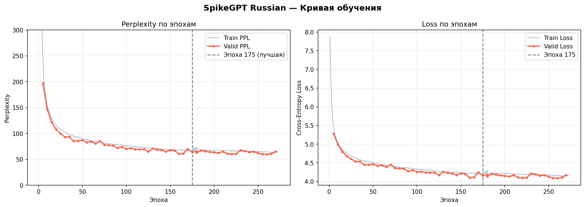
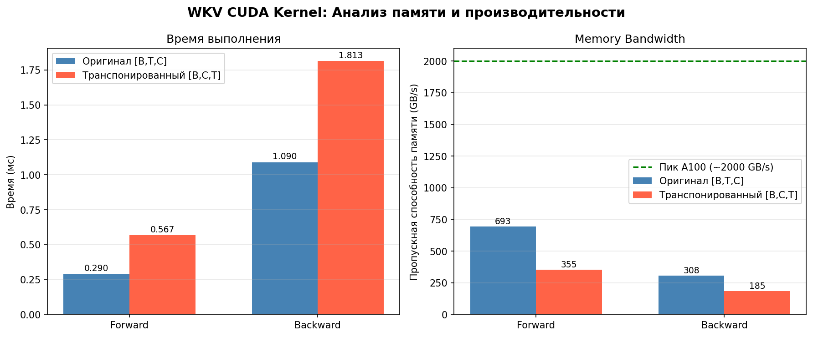
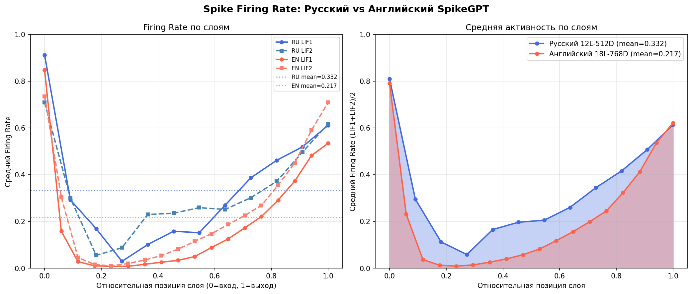
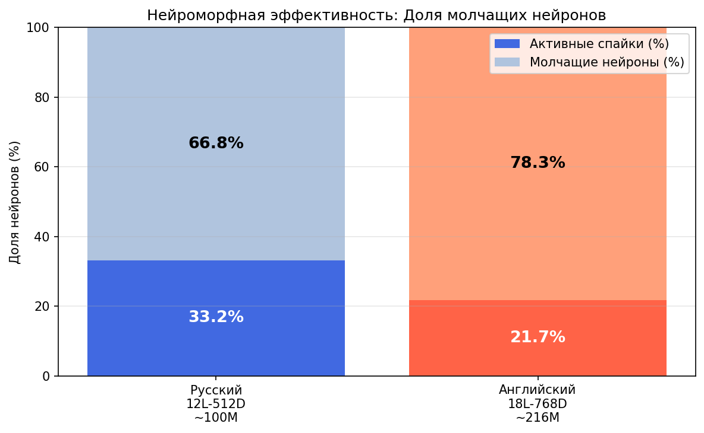
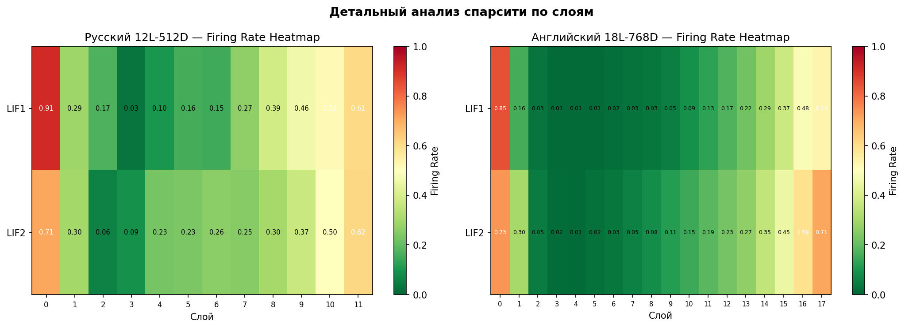

# SpikeGPT для русского языка

> Адаптация импульсной языковой модели SpikeGPT для обработки русскоязычных текстов.  
> Представлено на секции «Нейроморфные вычисления и искусственный интеллект».

---

## Аннотация

В данной работе представлена адаптация импульсной языковой модели **SpikeGPT** [1] для русского языка. SpikeGPT основана на архитектуре RWKV с бинарными событийно-управляемыми LIF-нейронами (Leaky Integrate-and-Fire), что делает её пригодной для эффективного выполнения на нейроморфном аппаратном обеспечении. Оригинальная модель обучалась исключительно на английском языке; настоящая работа впервые демонстрирует применимость данной архитектуры к морфологически богатому языку на корпусе объёмом ~1,8 млрд токенов.

Проведены: полное обучение модели с нуля, анализ вычислительной эффективности CUDA-ядра WKV-оператора, сравнительный анализ нейроморфной спарсити для русского и английского языков, а также качественная оценка генерации текста.

---

## Конфигурация модели

| Параметр | Значение |
|---|---|
| Архитектура | SpikeGPT (RWKV + MultiStepLIF) |
| Число параметров | ~100M (12 слоёв, d\_model = 512) |
| Токенизатор | ruGPT-3 Large BPE (vocab = 50 258) |
| Обучающий корпус | Тайга: taiga\_stripped\_rest + taiga\_stripped\_proza |
| Объём данных | ~1,8 млрд токенов |
| Длина контекста | 1 024 токена |
| Batch size | 32 |
| Learning rate | 6·10⁻⁴ → 1·10⁻⁵ (cosine decay) |
| Оборудование | NVIDIA A100 SXM 80 GB |

---

## Результаты обучения

Модель демонстрирует устойчивую сходимость на протяжении 270 эпох. Лучший результат достигнут на эпохе 260:

| Метрика | Значение |
|---|---|
| Valid Perplexity (лучшая) | **59,79** (эпоха 260) |
| Train Perplexity (финал) | ~64 |
| Скорость обучения | ~2 мин/эпоха на A100 |



---

## Анализ CUDA-ядра WKV

Проведён анализ вычислительной эффективности CUDA-ядра WKV-оператора — ключевого компонента RWKV-архитектуры. Исследован вопрос оптимальности паттерна доступа к памяти при текущем layout тензоров [B, T, C].

| Метрика | Оригинал [B,T,C] | Транспонированный [B,C,T] |
|---|---|---|
| Forward, мс | **0,29** | 0,57 |
| Backward, мс | **1,09** | 1,81 |
| Forward bandwidth | **693 GB/s** | 355 GB/s |
| Backward bandwidth | **308 GB/s** | 185 GB/s |



**Вывод.** Оригинальная реализация ядра уже обеспечивает оптимальный коалесцированный доступ к памяти (693 GB/s ≈ 35% от пикового HBM bandwidth A100). При layout [B, T, C] и блоке из 32 потоков соседние потоки в варпе обращаются к смежным адресам памяти. Изменение layout на [B, C, T] вводит stride-T некоалесцированный доступ и приводит к деградации производительности в 2×.

---

## Сравнительный анализ нейроморфной спарсити

Измерена средняя доля активных LIF-нейронов (firing rate) при прогоне реальных текстов через обе модели. Для русской модели использован корпус Тайга, для английской — OpenWebText (Skylion007/openwebtext).

| Модель | Firing Rate | Молчащие нейроны |
|---|---|---|
| SpikeGPT Russian (12L-512D, ~100M) | 33,2% | **66,8%** |
| SpikeGPT English (18L-768D, ~216M) [1] | 21,7% | **78,3%** |





**Ключевые наблюдения:**

1. **Русский язык требует на 53% больше нейронной активности**, чем английский (0,332 / 0,217 = 1,53×). На нейроморфном железе (Intel Loihi, BrainScaleS) энергопотребление пропорционально числу спайков.

2. **U-образный паттерн активации** присутствует в обеих моделях: высокая активность в слое 0 (embedding), минимум в средних слоях, монотонный рост к выходным слоям. Данная закономерность является структурным свойством архитектуры SpikeGPT.

3. **Критическое различие в средних слоях** (относительная позиция 0,35–0,65): английская модель практически неактивна (LIF2 < 1–5%), русская поддерживает устойчивую активность ~20–25%. Предполагаемая причина — необходимость ранней обработки морфологических зависимостей (падежи, согласование по роду и числу).



---

## Качественная оценка генерации

Модель является базовой языковой моделью без instruction tuning и генерирует текст в стиле обучающего корпуса. Оценка проводилась на промптах различных жанров.

### Художественная проза

**Промпт:** *«— Ты понимаешь, что это невозможно? — спросил он. — Почему же,»*

> — Почему же, так и не надо? Это просто анекдот. Почему ты не ешь?
> — Потому что я должен думать. У меня есть другая идея. Чтобы только из этого получилось. Ты знаешь, как мне тебя называть?
> — Я знаю. Если бы я сделал это со мной, мы были бы счастливы, если бы я был один. Я бы и сам этого не делал. Но это не значит, что я — никогда не виноват.
> — И что это? — спросила она.
> — Ты должен уметь писать и читать.
> Она сделала вид, что не поняла, что он говорил. Она вдруг спросила:
> — Скажи мне, что ты хочешь, чтобы я написал книгу?..

**Промпт:** *«Поздним вечером улицы Москвы опустели. Только одинокий фонарь освещал»*

> ...улицы, а в них просыпалась тень умирающего. Вылезая из окон, они стояли и смотрели на небо. Как много-много лет спустя в жизни они обретали славу. Неважно. Но это уже не тот случай, когда умер человек. А наутро у Крусановича мелькнула рука...

### Публицистика

**Промпт:** *«В октябре 1917 года в Петрограде произошли события, которые навсегда изменили»*

> ...значение для жизни страны. В результате большевистского восстания 1917 года погибло больше 800 человек, из них 700 тысяч получили ранения. Неудивительно, что по сравнению с этим периодом СССР, возможно, уже произошло несколько десятков убийств в Париже...

**Наблюдение по доменам:**

| Домен | Качество | Причина |
|---|---|---|
| Художественная проза | Высокое | Доминирует в корпусе Тайга |
| Новости / публицистика | Среднее | Хорошо представлен в корпусе |
| История | Среднее | Фактические ошибки, стиль сохраняется |
| Микроэлектроника / точные науки | Низкое | Домен не представлен в корпусе |

---

## Структура репозитория

```
SpikeGPT/
├── train.py                    # Скрипт обучения
├── generate.py                 # Генерация текста с заданным промптом
├── demo.py                     # Демонстрационная сессия (10 примеров)
├── prepare_data.py             # Токенизация корпуса Тайга → .npy
├── setup.sh                    # Автоматическая загрузка данных и токенизатора
├── src/
│   ├── model.py                # Архитектура SpikeGPT (RWKV + LIF)
│   ├── trainer.py              # Цикл обучения с поддержкой resume
│   └── utils.py                # Dataset, TOKENIZER
├── cuda/
│   ├── wkv_cuda.cu             # Оригинальное CUDA-ядро WKV
│   └── wkv_cuda_opt.cu         # Транспонированное ядро [B,C,T] (эксперимент)
├── benchmarks/
│   └── wkv_benchmark.py        # Бенчмарк CUDA-ядра (время, bandwidth)
├── analysis/
│   ├── spike_sparsity.py       # Firing rate по слоям (русская модель)
│   ├── spike_sparsity_en.py    # Firing rate по слоям (английская модель)
│   ├── compare_sparsity.py     # Сравнительный анализ RU vs EN
│   ├── generate_report.py      # Генерация графиков и отчёта RESULTS.md
│   └── figures/                # Графики (PNG)
├── checkpoints/                # Сохранённые чекпоинты (каждые 10 эпох)
├── tokenizer/rugpt3/           # ruGPT-3 токенизатор (локально)
├── RESULTS.md                  # Подробный отчёт с графиками
└── demo_results.md             # Примеры генерации текста
```

---

## Воспроизведение результатов

### 1. Установка зависимостей и загрузка данных

```bash
HF_TOKEN=hf_ваш_токен bash setup.sh
```

Скрипт загружает токенизатор ruGPT-3, корпуса Тайга (~4 GB), токенизирует и объединяет их в `data/ru_train_full.npy`.

### 2. Обучение

```bash
python train.py
```

Автоматически продолжает обучение с последнего чекпоинта при наличии файлов в `checkpoints/`.

### 3. Генерация текста

```bash
# Одиночный промпт
python generate.py \
  --prompt "Осенний лес был тих и задумчив." \
  --checkpoint checkpoints/spikegpt-ru-261.pth \
  --temperature 0.85 --top_p 0.9

# Демонстрационная сессия (9 промптов, результаты в demo_results.md)
python demo.py
```

### 4. Анализ спарсити

```bash
# Firing rate русской модели
python analysis/spike_sparsity.py

# Сравнение с английской моделью (автоматически скачивает ridger/SpikeGPT-OpenWebText-216M)
python analysis/compare_sparsity.py
```

### 5. Бенчмарк CUDA-ядра

```bash
python benchmarks/wkv_benchmark.py
```

### 6. Генерация всех графиков и отчёта

```bash
python analysis/generate_report.py
```

---

## Выводы

1. **Применимость SpikeGPT к русскому языку подтверждена** — модель сходится и генерирует связный русскоязычный текст (Valid PPL = 59,79).

2. **CUDA-ядро WKV оптимально** — оригинальная реализация достигает 35% от пикового memory bandwidth A100 (693 GB/s) за счёт коалесцированного доступа к памяти. Изменение layout контрпродуктивно.

3. **Морфологическая сложность языка влияет на нейроморфную эффективность** — русский язык требует на 53% больше спайков по сравнению с английским, что пропорционально увеличивает энергопотребление на нейроморфном железе.

4. **Доменная специализация критична** — для применения в технических областях необходимо дообучение на специализированных корпусах.

---

## Направления дальнейшей работы

- Дообучение на технических и научных корпусах по микроэлектронике
- Обучаемые параметры LIF-нейронов (LearnableLIF) для адаптации динамики к языковым особенностям
- Оценка на стандартных русскоязычных бенчмарках (TAPE, RuBench, RuGLUE)
- Инференс на нейроморфном железе с измерением реального энергопотребления
- Instruction tuning для диалоговых задач

---

## Цитирование

Если вы используете данную работу, пожалуйста, цитируйте оригинальную статью SpikeGPT:

```bibtex
@article{zhu2023spikegpt,
    title   = {SpikeGPT: Generative Pre-trained Language Model with Spiking Neural Networks},
    author  = {Zhu, Rui-Jie and Zhao, Qihang and Li, Guoqi and Eshraghian, Jason K.},
    journal = {arXiv preprint arXiv:2302.13939},
    year    = {2023}
}
```

---

*Модель: SpikeGPT 100M | Корпус: Тайга ~1,8 млрд токенов | Оборудование: NVIDIA A100 SXM 80 GB*
